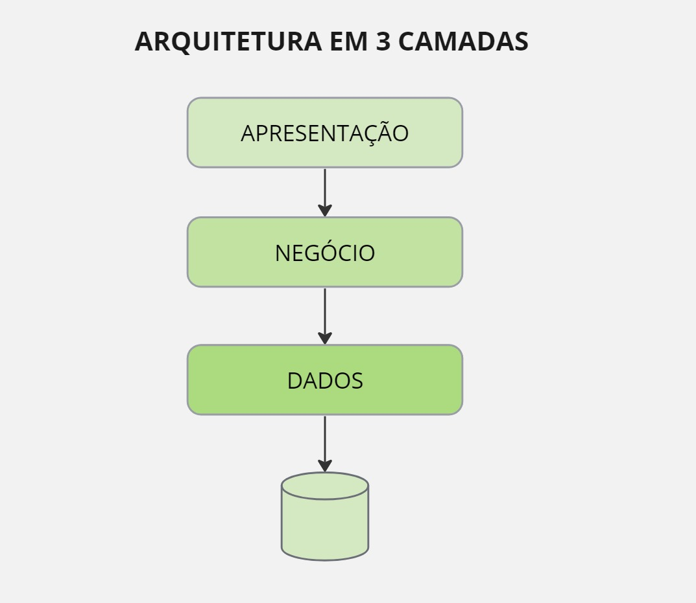

<h3>DESAFIO DE PROJETO: Criando scripts SQL </h3>

Projeto: Nacional Seminovos

Profa: Juliana Mascarenhas

Disciplina: SQL_Fundamentos de Banco de Dados

### :small_orange_diamond:Objetivo:

 ✔️`:heavy_check_mark:` Explorar scripts SQL na ferramenta do MySQL

 ✔️Estudar Modelo Lógico

 ✔️ Utilizamos scripts no Jupyter Lab para gerar dados aleatórios como nomes, cpf, endereços, telefones, renavans de veículos, contas bancárias, etc. Gerando dados para serem inseridos no Banco de dados Nacional_seminovos.

### :small_orange_diamond:Ferramentas:

[MySQL_Workbench](https://www.mysql.com/products/workbench/): Para modelagem e visualização do MER

### [MySQL](https://www.mysql.com/): Como SGDB

